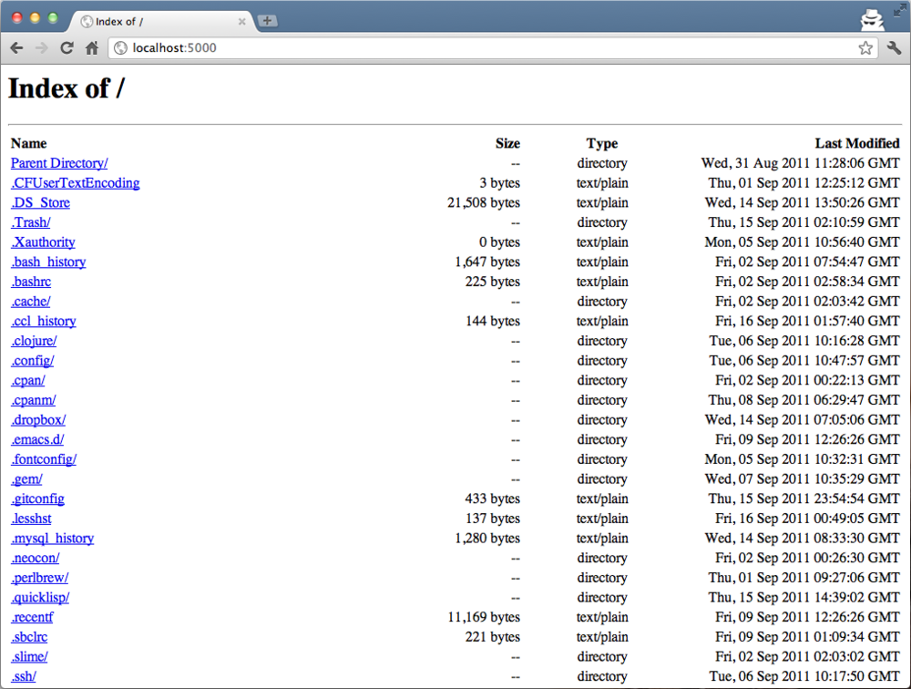

`Clack.App.Directory` is a real example of a Clack application that uses
`<component>`. This application returns directory information as an HTML page.

Using this application is pretty easy:

~~~lisp
;; mount /path/to/your/home/ to http://localhost:5000/
(clack:clackup
 (make-instance 'clack.app.directory:<clack-app-directory>
    :root #p"/path/to/your/home")
 :port 5000)
~~~

Open your web browser and go to http://localhost:5000/. You will see a list of
files in your home directory.

Can you see why this application was implemented not just as a function but by
using `<component>`? When you create the instance, you set `:root`, which
changes the behavior of the application. It is difficult to achieve this
functionality by using functions.

I know functions returning a closure can do similar things. But that would be
complicated. Moreover, there is another advantage of using classes:
<strong>inheritance</strong>. To tell the truth, `<clack-app-directory>` doesn't
inherit `<component>` directly. It inehrits `<clack-app-file>`, whose
functionality is to simply return a file (not directory information). What
`<clack-app-directory>` per se has implemented is only the feature to return a
list of files in a directory.  If you are curious about these stuffs, please
take a look at directory.lisp and file.lisp in the core/apps/ directory. These
will tell you the details of how components are used in Clack applications.
