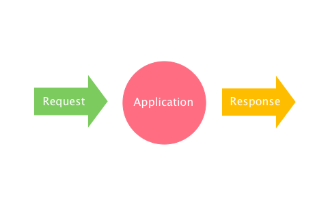

In this chapter, I'd like to introduce a new term: **middleware**, which is the
most important concept to understand why Clack is so powerful and extensible
without losing simplicity.

## What's middleware?

So far, what Clack applications do is just to take a request and return a
response.

Let's add middlewares to this figure.

The middlewares are surrounding the application. They take requests before the
application takes them and receive the responses the application generates. By
wrapping the application, the middlewares enable you to change the application's
behaviour without modifying the application's code.

This mechanism has the potential to improve web application development.

## Clack.Middleware

Writing a Clack middleware is not so difficult once you understand Clack
component.

~~~lisp
;; importing symbols for readability.
(import '(clack:<middleware>
          clack:call
          clack:call-next))

(defclass <sample-mw> (<middleware>) ())

(defmethod call ((this <sample-mw>) env)
  ;; preprocessing
  (let ((response (call-next this env)))
    ;; postprocessing
    ))
~~~

A Clack middleware is a subclass of `<middleware>`, which has a similar
structure as `<component>`. For example, middlewares also implement `call`
methods.

Have you noticed a `call-next` function in the above example? `call-next` calls
"the next" component, middleware, or application. Take a look at the second
figure in this page again. Middlewares wrap components such as other middlewares
and applications. By calling `call-next`, middlewares can call another component
in the "multi-shell" structure.

The beauty of middleware is that it can be reused among web applications. In the
next chapter, I'll show you a real example of a middleware.
