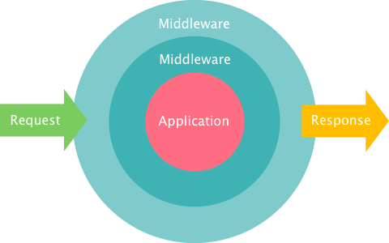

In this chapter, I would like to introduce
[Clack.Builder](http://clacklisp.org/doc/clack.builder.html), or the most common
way to use Clack middlewares. Clack.Builder calls middlewares'
`wrap`s sequentially and returns a function, which you can use as a
Clack application.

The syntax of Clack.Builder is easy:

~~~lisp
(builder
  ;; Write Middleware classes here.
  #'app)
;=> Function (as an Application)
~~~

For example,

~~~lisp
(import 'clack.builder:builder)

(defun app (env)
  (declare (ignore env))
  '(200
    (:content-type "text/plain")
    ("Hello, Clack!")))

(clack:clackup
  (builder
    <clack-middleware-session>
    (<clack-middleware-static>
      :path "/public/"
      :root #p"/path/to/static-files/")
    #'app))
~~~

`<clack-middleware-session>` is a middleware for session management, which adds
`:clack.session` to `env` and enables you to handle sessions as a hash
table. See
[Clack.Middleware.Session](http://clacklisp.org/doc/clack.middleware.session.html)
for the details.

Note that `builder` calls `wrap`s from bottom to top. In this example, `#'app`
is wrapped by `<clack-middleware-static>` first, and the resulting entity is
wrapped by `<clack-middleware-session>`.

Let's take a look at the figure in [Chapter 7](07-middleware.html) again.

In terms of this figure, `<clack-middleware-session>` is the outer middleware,
and `<clack-middleware-static>` is the inner one.
